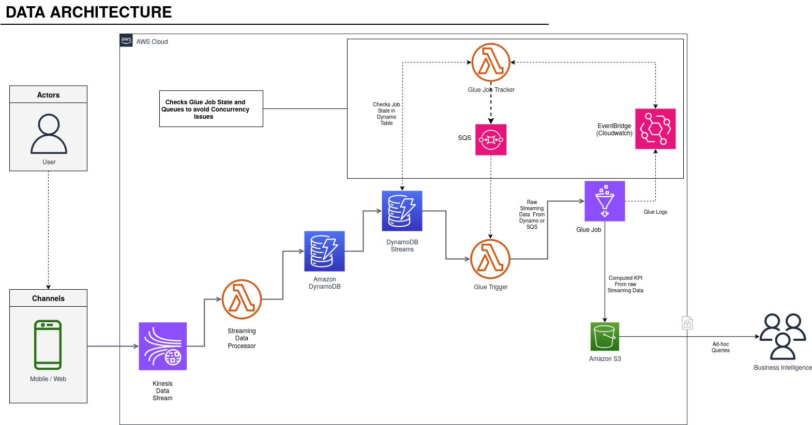

# Objective: Design and implement a real-time trip data ingestion and analytics pipeline

This project simulates a real-world, event-driven architecture and will test your ability to build
scalable ingestion, processing, and aggregation pipelines using AWS-native services.


+ 


#  Real-Time Glue ETL Orchestration with Kinesis, Lambda, DynamoDB, EventBridge, and Delta Lake

This project orchestrates a **serverless real-time ETL pipeline** that processes streaming data from **Kinesis**, persists and tracks job states with **DynamoDB**, manages concurrency with **SQS**, and writes computed **KPIs to Delta Lake on S3**. Glue job orchestration is automated using **Lambda + EventBridge**.

---

##  Architecture Overview

```text
Kinesis Data Stream
        ↓
  Stream Processor (Lambda)
        ↓
  TripEvents (DynamoDB) ──────▶ TTL Cleanup
        ↓
  Glue Trigger (Lambda) ──────▶ Glue Job
        ↑                          ↓
 EventBridge (Glue Job Events)    ↓
        ↑                   KPI Write to Delta Lake (S3)
    Glue Queue Lambda
        ↓
     SQS Queue
```

---

##  Components

| Component                     | Role                                                         |
| ----------------------------- | ------------------------------------------------------------ |
| **Kinesis Stream**            | Ingests real-time event data                                 |
| **Lambda - Stream Processor** | Parses and stores events to DynamoDB (`TripEvents`)          |
| **DynamoDB - TripEvents**     | Stores raw trip events with TTL for cleanup                  |
| **DynamoDB - JobTracking**    | Tracks Glue job state and metadata                           |
| **SQS Queue**                 | Buffers jobs over concurrency threshold                      |
| **Lambda - Glue Trigger**     | Manages Glue job launches with concurrency control           |
| **Lambda - Glue Queue**       | Listens to EventBridge events and dequeues from SQS          |
| **EventBridge**               | Triggers on Glue job state changes                           |
| **Glue Job**                  | Processes staged S3 JSONs, aggregates KPIs, upserts to Delta |
| **Delta Lake (on S3)**        | Stores computed KPIs partitioned by `trip_date`              |


##  Glue Job Logic (`kpi-computation.py`)

* Reads **staged JSON files** from S3
* Flattens and filters valid rows
* Calculates KPIs (`sum`, `count`, `min`, `max`)
* Writes:

  * Raw data → Archived to S3 (partitioned by `trip_date`)
  * KPIs → Upserts into **Delta Lake on S3**
* Runs `OPTIMIZE` and `VACUUM` for Delta compaction & cleanup

---


## AWS Glue Job Orchestration with Lambda, SQS, EventBridge & DynamoDB

This setup enables scalable orchestration of AWS Glue jobs using Lambda, with job tracking in DynamoDB, concurrency control via SQS, and job state monitoring via EventBridge.

---

##  Architecture Overview For Glue Job Concurrency and Monitoring

- **Glue Jobs** – ETL workloads
- **Lambda Functions**
  - `glue-trigger` – Orchestrates Glue jobs with concurrency control
  - `glue-queue` – Updates job tracking and triggers follow-up jobs
- **SQS** – Queues jobs exceeding concurrency limits
- **DynamoDB** – Tracks job metadata and lifecycle
- **EventBridge** – Detects Glue job completion events

---

##  Setup Instructions

### 1. Variables

Replace the following placeholders before executing commands:

| Placeholder            | Description                            |
|------------------------|----------------------------------------|
| `<REGION>`             | AWS Region (e.g., `us-east-1`)         |
| `<ACCOUNT_ID>`         | Your AWS Account ID                    |
| `<GLUE_QUEUE_FN>`      | Name of `glue-queue` Lambda function   |
| `<GLUE_TRIGGER_FN>`    | Name of `glue-trigger` Lambda function |
| `<SQS_QUEUE_NAME>`     | SQS queue for pending jobs             |
| `<SQS_QUEUE_URL>`      | Full SQS URL                           |
| `<TRACKING_TABLE>`     | DynamoDB job tracking table name       |

---

### 2. Create DynamoDB Tables

#### a. Glue Job Tracking Table

```bash
aws dynamodb create-table \
  --table-name <TRACKING_TABLE> \
  --attribute-definitions AttributeName=JobRunId,AttributeType=S \
  --key-schema AttributeName=JobRunId,KeyType=HASH \
  --provisioned-throughput ReadCapacityUnits=5,WriteCapacityUnits=5 \
  --region <REGION>
````

Enable DynamoDB Streams (optional):

```bash
aws dynamodb update-table \
  --table-name <TRACKING_TABLE> \
  --stream-specification StreamEnabled=true,StreamViewType=NEW_AND_OLD_IMAGES \
  --region <REGION>
```

#### b. (Optional) TTL-Enabled Table

```bash
aws dynamodb create-table \
  --table-name TripEvents \
  --attribute-definitions AttributeName=trip_id,AttributeType=S \
  --key-schema AttributeName=trip_id,KeyType=HASH \
  --billing-mode PAY_PER_REQUEST \
  --region <REGION>

aws dynamodb update-time-to-live \
  --table-name TripEvents \
  --time-to-live-specification "Enabled=true, AttributeName=expire_at" \
  --region <REGION>
```

---

### 3. Create EventBridge Rule for Glue Job Completion

#### a. Create Rule

```bash
aws events put-rule \
  --name glue-job-completion-rule \
  --event-pattern '{
    "source": ["aws.glue"],
    "detail-type": ["Glue Job State Change"],
    "detail": {
      "state": ["SUCCEEDED", "FAILED", "TIMEOUT", "STOPPED"]
    }
  }' \
  --state ENABLED \
  --region <REGION>
```

#### b. Add Lambda Target

```bash
aws events put-targets \
  --rule glue-job-completion-rule \
  --targets "[
    {
      \"Id\": \"GlueCompletionTarget\",
      \"Arn\": \"arn:aws:lambda:<REGION>:<ACCOUNT_ID>:function:<GLUE_QUEUE_FN>\"
    }
  ]" \
  --region <REGION>
```

#### c. Add Lambda Permission

```bash
aws lambda add-permission \
  --function-name <GLUE_QUEUE_FN> \
  --statement-id glue-eventbridge-invoke \
  --action "lambda:InvokeFunction" \
  --principal events.amazonaws.com \
  --source-arn arn:aws:events:<REGION>:<ACCOUNT_ID>:rule/glue-job-completion-rule \
  --region <REGION>
```

---

### 4. Set Lambda Environment Variables

#### a. `glue-trigger`

```bash
aws lambda update-function-configuration \
  --function-name <GLUE_TRIGGER_FN> \
  --environment "Variables={
    SQS_QUEUE_URL=https://sqs.<REGION>.amazonaws.com/<ACCOUNT_ID>/<SQS_QUEUE_NAME>,
    DYNAMODB_TABLE=<TRACKING_TABLE>
  }" \
  --region <REGION>
```

#### b. `glue-queue`

```bash
aws lambda update-function-configuration \
  --function-name <GLUE_QUEUE_FN> \
  --environment "Variables={
    DYNAMODB_TABLE=<TRACKING_TABLE>,
    ORCHESTRATOR_LAMBDA_NAME=<GLUE_TRIGGER_FN>,
    SQS_QUEUE_URL=https://sqs.<REGION>.amazonaws.com/<ACCOUNT_ID>/<SQS_QUEUE_NAME>
  }" \
  --region <REGION>
```

---


##  Summary

* Controlled Glue job concurrency with SQS
* Durable job tracking in DynamoDB
* Fully event-driven orchestration with Lambda + EventBridge
* Modular and scalable workflow


##  Features

*  Concurrency-controlled Glue job orchestration
*  Event-driven state tracking
*  Resilient with retries, dead-lettering, and streaming durability
*  Automated KPI aggregation with Delta support
*  TTL-based cleanup for TripEvents

---

##  Notes

* Ensure Glue has access to Delta Lake JARs (e.g., AWS Glue 3.0 with Spark 3.1+).
* Optimize IAM permissions and Lambda memory/runtime for performance.
* Monitor via CloudWatch Metrics & Logs for each component.

---
